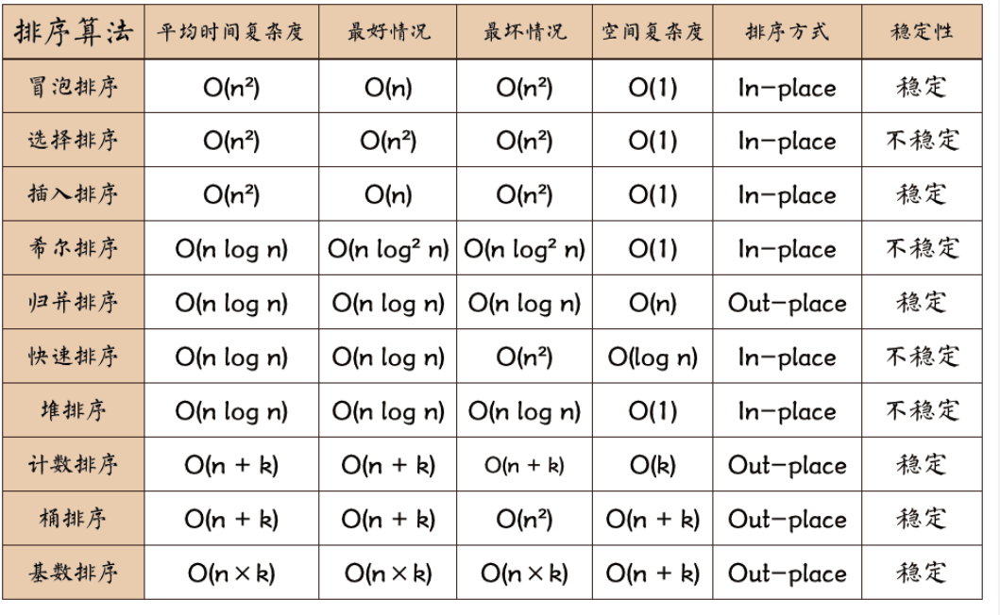

## 10 大排序



### 1.选择排序

```cpp
void select_sort(vector<int> &arr) {
    for (int i = 0; i < arr.size(); ++i) {
        int min = i;
        for (int j = i + 1; j < arr.size(); ++j) {
            if (arr[j] <= arr[min]) {
                min = j;
            }
        }
        swap(arr[i], arr[min]);
    }
}
```

### 2.冒泡排序

```cpp
void bubble_sort1(vector<int> &arr) {
    int len = arr.size();
    int i, j;
    for (int i = 0; i < len - 1; ++i) {
        for (j = 0; j < len - 1 - i; j++){
            if (arr[j] > arr[j+1]) {
                swap(arr[j+1], arr[j]);
            }
        }
    }

}
void swap_xor(vector<int>::value_type &value1, vector<int>::value_type &value2) {
    value1 = value1 ^ value2;
    value2 = value1 ^ value2;
    value1 = value1 ^ value2;
};
void bubble_sort2(vector<int> &arr) {
    int len = arr.size();
    int i, j;
    for (int i = 0; i < len - 1; ++i) {
        for (int j = i + 1; j < len; ++j) {
            if (arr[j] < arr[i]) {
                swap_xor(arr[i], arr[j]);
            }
        }
    }
}
```

### 3.插入排序

```
// 3. 插入排序 移动位法
void insert_sort1(vector<int> &arr) {
    int len = arr.size();
    for (int i = 1; i < len; ++i) {
        vector<int>::value_type key = arr[i];
        int j = i - 1;
        while ((j >= 0) && key < arr[j]) {

            arr[j + 1] = arr[j];
            j--;
        }
        arr[j + 1] = key;
    }
}
// 3. 插入排序 交换法
void insert_sort2(vector<int> &arr) {
    int len = arr.size();
    for (int i = 1; i < len; ++i) {
        for (int j = i-1; j >=0 ; j--) {
            if(arr[j]>arr[j+1]){
                swap(arr[j],arr[j+1]);
            }
        }
    }
}
```

### 4.希尔排序 （while）

```
void shell_sort1(vector<int> &arr) {
    int len = arr.size();
    int interval = len >> 1; // 获取初始长度
    while (interval >= 1) {
        for (int i = interval; i < len; ++i) {

            vector<int>::value_type tmp = arr[i];
            int j = i;
            while ((j - interval >= 0) && (arr[j - interval] > tmp)) {

                arr[j] = arr[j - interval];
                j -= interval;

            }
            arr[j] = tmp;
        }
        interval /= 2;
    }
}
```

### 4.希尔排序 （3 for）

```
// 4. 希尔排序 3 for
void shell_sort2(vector<int> &nums) {
    int len = nums.size();
    for (int gap = len / 2; gap > 0; gap /= 2) {
        for (int i = gap; i < len; i++) {
            for (int j = i - gap; j >= 0; j -= gap) {
                if (nums[j] > nums[j + gap]) {
                    swap(nums[j + gap], nums[j]);
                } else break;
            }
        }
    }
}
```

### 5.归并排序 (递归)

```
void merge1(int arr[], int l, int q, int r) {

    int n = r - l + 1;
    int *tmp = new int[n];
    int i = 0;
    int left = l;
    int right = q + 1;
    while (left <= q && right <= r) {
        tmp[i++] = arr[left] <= arr[right] ? arr[left++] : arr[right++];
    }
    while (left <= q) {
        tmp[i++] = arr[left++];
    }
    while (right <= r) {

        tmp[i++] = arr[right++];

    }
    copy(tmp, tmp + n, arr + l);
    delete[] tmp;

}
void merge_sort1(int *arr, int l, int r) {
    if (l == r) {

        return;
    }
    int q = (l + r) >> 1;
    merge_sort1(arr, l, q);
    merge_sort1(arr, q + 1, r);
    merge1(arr, l, q, r);

}
```

### 5.归并排序 (迭代)

```
// 5. 归并排序  (迭代)
void merge_sort2(vector<int> & arr) {
    int len = arr.size();
    vector<int> tmp(len,0);

    for (int seg = 1; seg < len; seg += seg) {
        for (int start = 0; start < len; start += seg + seg) {
            int low = start, mid = min(start + seg, len);
            int high = min(start + seg + seg, len);
            int k = low;
            int start1 = low, end1 = mid;
            int start2 = mid, end2 = high;

            while (start1 < end1 && start2 < end2) {
                tmp[k++] = arr[start1] < arr[start2] ? arr[start1++] : arr[start2++];
            }
            while (start1 < end1) {
                tmp[k++] = arr[start1++];
            }
            while (start2 < end2) {
                tmp[k++] = arr[start2++];
            }
        }
        copy(tmp.begin(), tmp.end(), arr.begin());
    }
}
```

### 6.快速排序

```
int quick_sort_parition(vector<int> &arr, int  low, int  hig) {


    vector<int>::value_type pivot =arr[low];


    while (low < hig) {

        while (low < hig && arr[hig] >= pivot  ) {
            hig--;
        }

        arr[low]=arr[hig];
        while (low<hig && arr[low] <= pivot ) {
            low++;
        }
        arr[hig]=arr[low];

    }
    arr[low] = pivot;
    return low;

}
void quick_sort(vector<int> &arr,int low, int hig){
    if(low<hig){
        int pivot = quick_sort_parition(arr, low, hig);
        quick_sort(arr, low, pivot - 1);
        quick_sort(arr, pivot + 1, hig);
    }
}
```

### 7.记数排序

```
void count_sort(vector<int> &arr) {

    int len = arr.size();
    vector<int>::value_type maxx = *max_element(arr.begin(), arr.end());
    vector<int>::value_type minx = *min_element(arr.begin(), arr.end());
    vector<int> tmp(maxx - minx + 1, 0);
    vector<int> ans;
    for (int i = 0; i < len; ++i) {
        tmp[arr[i] - minx]++;
    }
    for (int j = 0; j < maxx - minx + 1; ++j) {
        while (tmp[j] != 0) {

            ans.push_back(j + minx);
            tmp[j]--;
        }

    }
    copy(ans.begin(), ans.end(), arr.begin());
}
```

### 8. 桶排序

```
void insert_list_sort(vector<int> &arr) {
    int len = arr.size();
    for (int i = 1; i < len; ++i) {
        for (int j = i-1; j >=0 ; j--) {
            if(arr[j]>arr[j+1]){
                swap(arr[j],arr[j+1]);
            }
        }
    }
}

void bucket_sort(vector<int> & arr) {

    vector<int>::value_type maxx = *max_element(arr.begin(), arr.end());
    vector<int>::value_type minx = *min_element(arr.begin(), arr.end());
    const int bucket_size=maxx / 10 - minx / 10 + 1;;

    vector<vector<int>> bucket(bucket_size);  // 10个桶
    // 初始化空桶
    for (int i = 0; i < bucket_size; ++i) {
        vector<int> x{0};
        bucket.push_back(x);
    }
    for (int i = 0; i < arr.size(); ++i) {
        bucket[arr[i] / 10].push_back(arr[i]);
    }
    int index = 0;
    for (int i = 0; i < bucket_size; ++i) {
        // sort of bucket
        insert_list_sort(bucket[i]);

        for (auto it = bucket[i].begin(); it != bucket[i].end(); ++it) {
            arr[index++] = *it;

        }
    }
}
```

### 9.基数排序

```
void radix_sort(vector<int> &arr) {
    // get numberOfDigits  : numberOfDigits为位数
    vector<int>::value_type max = *max_element(arr.begin(), arr.end());
    int numberOfDigits = 0;
    while (max > 0) {
        max /= 10;
        numberOfDigits++;
    }
    const int BUCKETS = 10;
    vector<vector<int>> buckets(BUCKETS);
    for (int poss = 0; poss <= numberOfDigits - 1; ++poss) {
        int denominator = static_cast<int> (pow(10, poss));
        for (int &tmp: arr) {
            buckets[(tmp / denominator) % 10].push_back(tmp);

        }
        int index = 0;
        for (auto &thebuckett: buckets) {
            for (int &k: thebuckett) {
                arr[index++] = k;
                thebuckett.clear();
            }
        }
    }
}
```

### 10.堆排序

```
// https://www.cnblogs.com/chengxiao/p/6129630.html
namespace heap {
    void adjustHeap(vector<int> &arr, int i, int n) {
    int parent = i;
    int child = 2 * i + 1; // left child
    while (child < n) {
        // find  the max node in [left child node, right child node]
        // default left child node is the max
        // if  left child is less than right child ,so right child is the max.
        if (child + 1 < n && arr[child] < arr[child + 1]) {
            child++;
        }
        // if parents is less than the max child node.
        if (arr[parent] < arr[child]) {
            swap(arr[parent], arr[child]);
            parent = child;
        }
        child = child * 2 + 1;
    }
}

// create heap
void build_heap(vector<int> &arr, int size) {
    // father node is i
    // left child node is 2*i+1
    // right child node is 2*i+2
    for (int i =  (size/2) - 1; i >= 0; i--) {
        adjustHeap(arr, i, size);
    }
}

void heap_sort(vector<int> &arr, int size) {
    build_heap(arr, size);
    for (int i = size - 1; i > 0; i--) {
        swap(arr[i], arr[0]);
        adjustHeap(arr, 0, i);
    }
}

}
```