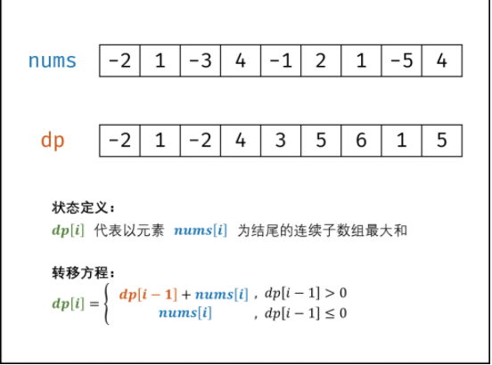
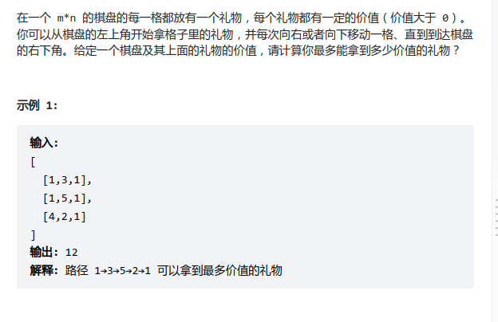
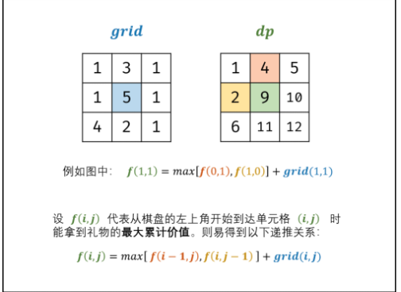
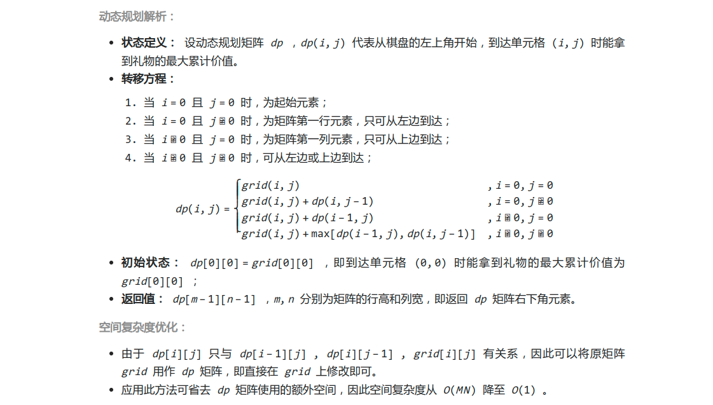
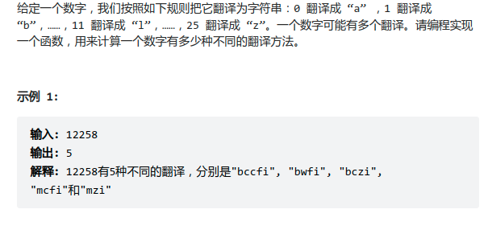
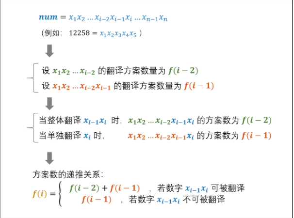

### 动态规划

#### [斐波那契数列](https://leetcode-cn.com/problems/fei-bo-na-qi-shu-lie-lcof/)

> f(n + 1) = f(n) + f(n - 1)*f*(*n*+1)=*f*(*n*)+*f*(*n*−1)

```cpp
class Solution {
    // time O(n) space O(1)
public:
    int mod = 1e9+7;
    int fib(int n) {
        int a=0,b=1,sum;
        for (int i = 0; i < n; ++i) {
            sum=(a+b) % mod;
            a=b;
            b=sum;
        }
        return a;
    }
};
```

#### [连续子数组的最大和](https://leetcode-cn.com/problems/lian-xu-zi-shu-zu-de-zui-da-he-lcof/)



```cpp
class Solution {
public:
    int maxSubArray(vector<int>& nums) {
        // dp
        int res = nums[0];
        for(int i = 1; i < nums.size(); i++) {
            nums[i] += max(nums[i - 1], 0);
            res = max(res, nums[i]);
        }
        return res;

    }
};
```

#### [剑指 Offer 47. 礼物的最大价值](https://leetcode-cn.com/problems/li-wu-de-zui-da-jie-zhi-lcof/)









```cpp
class Solution {
public:
    int maxValue(vector<vector<int>>& grid) {
        //  f(i, j)f(i,j) 为从棋盘左上角走至单元格 (i ,j)(i,j) 的礼物最大累计价值
        int m = grid.size(), n = grid[0].size();
        for (int i = 0; i < m; ++i) {
            for (int j = 0; j < n; ++j) {
                if(i == 0 && j == 0) continue;
                if(i == 0) {
                    grid[i][j] += grid[i][j - 1]; // dp
                }
                else if(j==0){
                    grid[i][j] += grid[i - 1][j];
                }else{
                    grid[i][j] += max(grid[i - 1][j], grid[i][j - 1]);
                }
            }
        }
        return grid[m - 1][n - 1];
    }
};

```

#### [剑指 Offer 46. 把数字翻译成字符串](https://leetcode-cn.com/problems/ba-shu-zi-fan-yi-cheng-zi-fu-chuan-lcof/)





```cpp
class Solution {
public:
    int translateNum(int num) {
        string stringNum = to_string(num);
        int n = stringNum.size();
        int dp[n];
        int a = 1, b = 1, c; // a=dp[i-1] b=dp[i-2]  b  ---> a ----> c

        for (int i = 2; i <= n; i++) {
            string tmp = stringNum.substr(i - 2, 2);
            if (tmp >= "10" && tmp <= "25") {
                c = a + b;
            } else {
                c = a;
            }
            b = a;
            a = c;
        }
        return a;
    }
};
```


