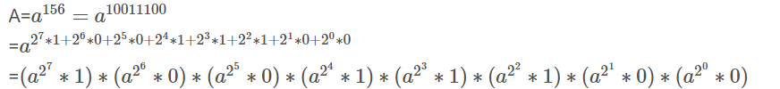

### 数论之矩阵快速幂


>  a^156,而156(10)=10011100(2)




普通快速幂的模板

```cpp
int fastpow(int base,int n,int mod){
	int ans=1;
	while(n){
		if(n&1){
            // 取n的最底位
            ans*=base%mod;
        } 
  
		base*=base;
		n>>=1;
	}
	return ans%mod;
}
```

