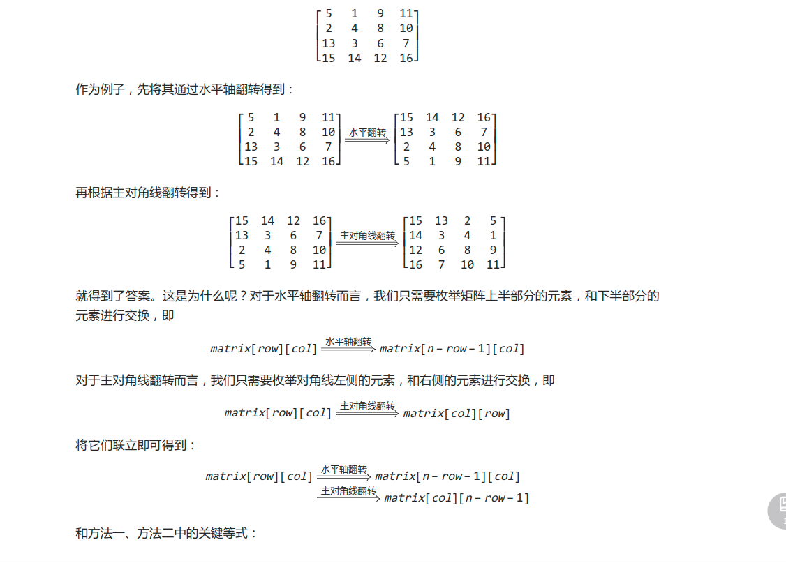

#### [ 旋转图像](https://leetcode-cn.com/problems/rotate-image/)

将二维矩阵原地顺时针旋转 90 度

```cpp
class Solution {
public:
    void rotate(vector<vector<int>>& matrix) {
        int n = matrix.size();
        // C++ 这里的 = 拷贝是值拷贝，会得到一个新的数组
        auto matrix_new = matrix;
        for (int i = 0; i < n; ++i) {
            for (int j = 0; j < n; ++j) {
                matrix_new[j][n - i - 1] = matrix[i][j];
            }
        }
        // 这里也是值拷贝
        matrix = matrix_new;
    }
};
```

```
矩阵操作
水平轴翻转
matrix[row][col] = matrix[n−row−1][col]
主对角线翻转
matrix[row][col]=matrix[col][row]
```

```cpp
class Solution {
public:
    void rotate(vector<vector<int>>& matrix) {
        int n = matrix.size();
        // 水平翻转
        for (int i = 0; i < n / 2; ++i) {
            for (int j = 0; j < n; ++j) {
                swap(matrix[i][j], matrix[n - i - 1][j]);
            }
        }
        // 主对角线翻转
        for (int i = 0; i < n; ++i) {
            for (int j = 0; j < i; ++j) {
                swap(matrix[i][j], matrix[j][i]);
            }
        }
    }
};
```

```cpp
class Solution3 {
public:
    void rotate(vector<vector<int>> &matrix) {
        int n = matrix.size();
        // 先沿对角线镜像对称二维矩阵
        for (int i = 0; i < n; ++i) {
            for (int j = 0; j < i; ++j) {
                swap(matrix[i][j], matrix[j][i]);
            }
        }
        // 然后反转二维矩阵的每一行
        for (vector<int> &mat: matrix) {
            reserve(mat);
        }
    }
    void reserve(vector<int> &nums) {
        for (int i = 0, j = nums.size() - 1; i < j; ++i, --j) {
            swap(nums[i], nums[j]);
        }
    }
};

```

沿左对角线翻转

```cpp
for (int i = 0; i < n; ++i) {
      for (int j = 0; j < i; ++j) {
                swap(matrix[i][j], matrix[j][i]);
            }
        }
```

```cpp
for (int i = 0; i < n; i++) {
        for (int j = i; j < n; j++) {
            swap(matrix[i][j], matrix[j][i]);
        }
}
```

沿右对角线翻转

```cpp
for (int i = 0; i < n; i++) {
        for (int j = 0; j < n - i; j++) {
            swap(matrix[i][j], matrix[n-j-1][n-i-1])
        }
}
```

将二维矩阵原地逆时针旋转 90 度

```java
// 将二维矩阵原地逆时针旋转 90 度
void rotate2(int[][] matrix) {
    int n = matrix.length;
    // 沿左下到右上的对角线镜像对称二维矩阵
    for (int i = 0; i < n; i++) {
        for (int j = 0; j < n - i; j++) {
            // swap(matrix[i][j], matrix[n-j-1][n-i-1])
            int temp = matrix[i][j];
            matrix[i][j] = matrix[n - j - 1][n - i - 1];
            matrix[n - j - 1][n - i - 1] = temp;
        }
    }
    // 然后反转二维矩阵的每一行
    for (int[] row : matrix) {
        reverse(row);
    }
}

void reverse(int[] arr) { /* 见上文 */}
```

